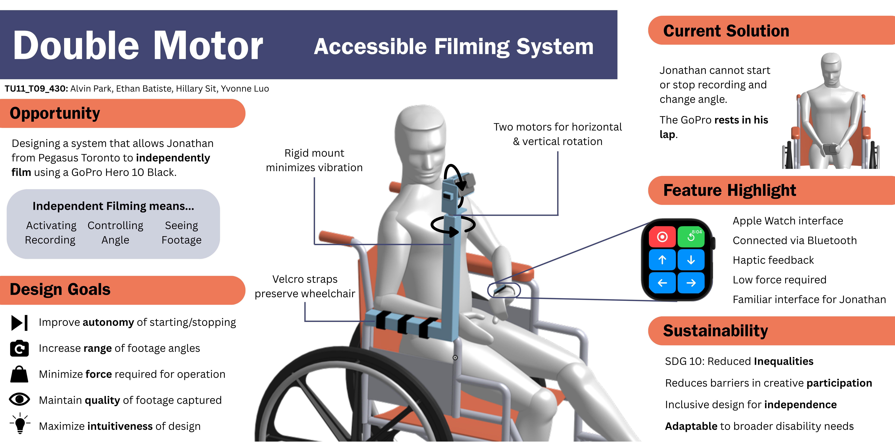

# Double Motor — Motorized Accessible Camera Mount

A two-axis, remotely-controlled GoPro mount I designed and built so a
wheelchair user with limited arm strength and grip could independently pan,
tilt, and trigger recording — no one holding the camera for them.


<!--  -->


## Context

Built for a real end user at Pegasus Toronto, a day program for adults with
developmental disabilities: a participant who films for the program's annual
short-film festival but couldn't hold a GoPro at eye level or reliably hit its
small, low-contrast buttons. The brief was to get him recording independently
without sacrificing footage quality or requiring staff assistance mid-shoot.

## What it does

A stepper + servo pan/tilt mount clamps to a wheelchair armrest and is driven
wirelessly from an Apple Watch over Bluetooth LE, so framing and
record/stop can happen with a light tap instead of a sustained, precise grip.

| Result (measured on prototype) | Value |
|---------------------------------|---------|
| Force required to operate       | < 0.6 N |
| Independent rotation axes       | 2 |
| Angle accuracy                  | 0.74° |
| Vibration amplitude at mount    | ~0 mm |

## My contributions

- **Mechanical design** — designed the two-axis pan/tilt mount and
  wheelchair-armrest attachment in Onshape, including the velcro-strap
  interface (no permanent modification to the chair) and edge/corner
  geometry for safe hand contact.
- **Firmware** — wrote the Arduino motor-control firmware (`src/main.cpp`,
  PlatformIO) driving the stepper and servo.
- **Systems testing** — ran the force, vibration, and angle-accuracy
  verification tests above, and helped test the SwiftUI/BLE control app
  against the physical prototype.

*(Full team: Alvin Park, Ethan Batiste, Hillary Sit, Yvonne Luo. The
BLE/SwiftUI control app below was primarily authored by a teammate.)*

## How it's built

```
src/main.cpp      Arduino firmware (PlatformIO, env "uno") — motor control
platformio.ini    Board/framework/library config
.vscode/          SwiftUI sources for the watch + Mac BLE control app
```

**Mechanical (Onshape)** — a rigid two-axis bracket carrying the GoPro,
mounted to a vertical arm that straps to the wheelchair armrest. A stepper
motor handles horizontal rotation and a micro servo handles tilt, positioned
to keep the camera at eye level.

<!-- [Onshape document link here] -->

**Firmware (`src/main.cpp`)** — reads two analog inputs, calibrates a neutral
center on boot, and drives the mount past a dead-zone threshold:

- `Stepper` (2048 steps/rev via a ULN2003 driver, pins 2/4/5/7) for horizontal
  pan.
- `Servo` (pin 6) for vertical tilt.

**Control app (`.vscode/`)** — a SwiftUI watchOS app (`Watch App Interface`)
and a macOS BLE test harness (`Apple Watch MacSim - Content View` +
`AppleWatch MacSim - BLE Manager`) that scans for an HM-10 BLE module
(advertised as `DSD TECH`), writes to characteristic `FFE1`, and sends
direction/record/reset commands as UTF-8 strings (`U`/`D`/`L`/`R`, `REC`,
`RESET`, `S` to stop).

## Tech stack

`C++` · `Arduino` / `PlatformIO` · `Swift` / `SwiftUI` · `Core Bluetooth (BLE)`
· `watchOS` · `Onshape`

## Next steps

- Material selection for the production enclosure.
- Safety testing on a high-fidelity prototype (drop test, continuous
  attachment under load, edge-radius compliance).
- Field validation with the end user on a fully assembled unit.
